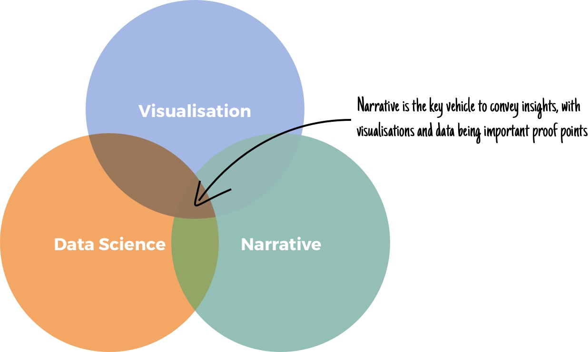
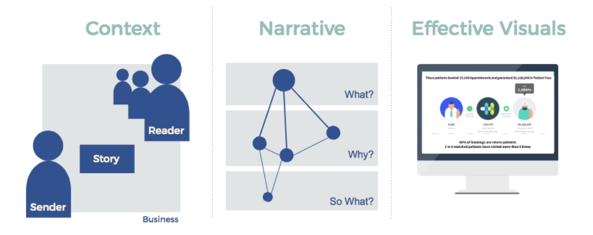

# The Art of Data Storytelling

BI tools, dashboards and spreadsheets have a number of limitations:

- Data wrangling and manual reporting is still prevalent. The need for human intervention slows data analytics and communications within organisations.
- These tools only present data as numbers and charts. They lack the vital component of narrative for effectively communicating information and insights.
- Current tools make scaling information requests impossible. Most marketing, sales, operations and analytics teams lack the resources and time to respond to all requests for reporting from every level of a company, including external stakeholders such as customers.

```Put simply, data in dashboards and spreadsheets only tell you   what  is happening. But, they do not tell you **why**.```

So how can enterprises transform their data centre into a profit centre, where all stakeholders benefit from having access to relevant data, shared in a language and format that suits them?

The answer is simple: adopt a data storytelling culture in your company.

## What Is Data Storytelling?

[Watch Video](https://www.youtube.com/watch?v=IIMHicxQ0LY)

[](https://www.youtube.com/watch?v=IIMHicxQ0LY)

- - -

## Why Data Storytelling Is The Future?

Why is data storytelling the future?
Data storytelling is a methodology for communicating information, tailored to a specific audience, with a compelling narrative. It is the last ten feet of your data analysis and arguably the most important aspect.

Evolutionarily, as Humans, we are naturally hard-wired to share stories as a means of sharing information.

Theorists even suggest that storytelling was the primary launchpad for the transmission of knowledge across large groups of people, which formed cultures as we know them today and allowed evolutionary success across generations.

Now, with the so much data available to us, only data storytelling can put a human perspective on the increasingly complex and rapidly changing world of the digital era.

- - -


Data storytelling merges three key fields of expertise:

**Data Science.**  

This field of expertise is the interdisciplinary field of sciences, which extracts knowledge and insight from data, making it readily available. This exciting field has made significant changes to our daily lives in the past couple of decades.

The technologies we take for granted are all driven by this field of expertise, but there is one thing that data scientists are not naturally skilled in:

**Storytelling.**

Data scientists are often skilled at, collecting and delivering data, but lack the skills to relay a true understanding of the opportunities hidden in the data delivered.

Visualisations:  The emergence of technology solutions such as dashboards became a natural solution in aiding us to comprehend our vast amounts of data collected. Transforming data into graphs, pie, and line charts meant we could see our data like never before, however, alone data visualisations have limitations. They provided at-a-glance snapshots of data, lacking the context needed to explain why something has happened.

Narrative:  The third and, somewhat, most vital part of a data story is the narrative. Narrative uses language in a format that suits our particular needs, augmenting our full comprehension of new information. A narrative is a key vehicle to convey insights, with visualisations and data being important proof points.

### Quotes

Aaron Levenstein, Business Professor at Baruch College:

> Statistics are like bikinis. What they reveal is suggestive, but what they conceal is vital.– 

## Why Is Data Storytelling So Powerful?



As humans, we are by nature, social creatures and we have evolved distinctively compared to other species as a function of our increasingly social world. Stories have the power to help us understand meaningful information and, as a consequence, can shape our values, determine our prejudices, and influence our dreams. Religious texts are the epitome of this; vertically through generations and horizontally among co-habitants, the most powerful stories written in such texts are still impacting the modern world to this day.

The psychology of stories, particularly in aid of memory, is a topic of extreme importance in our new age of information overload. By definition, facts simply present data; whereas, a story’s narrative  provides context, which augments our understanding and drives valuable insights.

Using stories to remember - known as the Story Method - is a simple technique used by memory champions. The method’s effectiveness is rooted in the use of narratives ability to aid the memory process, via the emotional aspect of a story which can engage more parts of the brain, making the story, and its elements, easier to recall.

A study conducted by a team at Berkley aimed to prove this, you can see their results here:

[Watch Video](https://www.youtube.com/watch?v=q1a7tiA1Qzo)

[](https://www.youtube.com/watch?v=q1a7tiA1Qzo)
